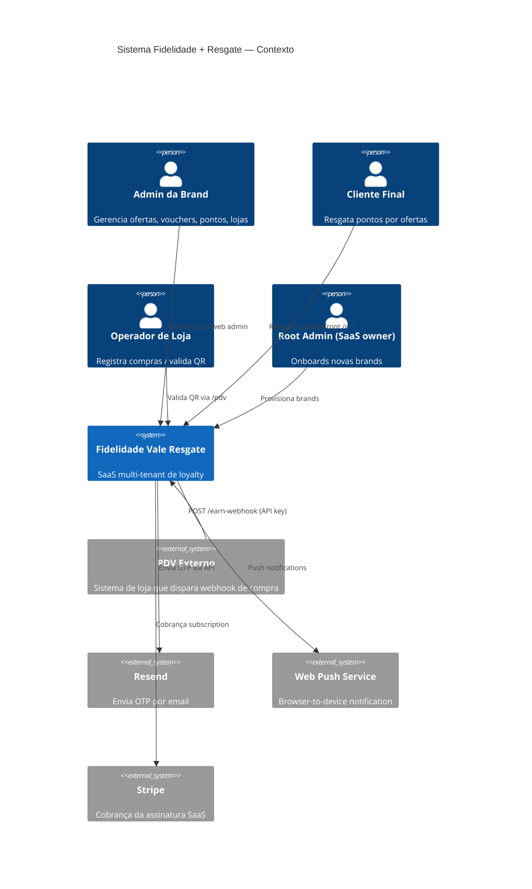
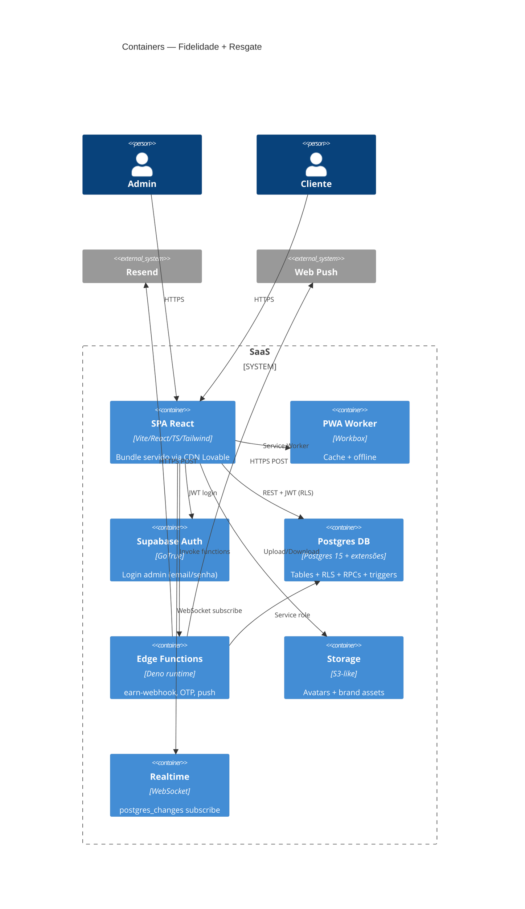
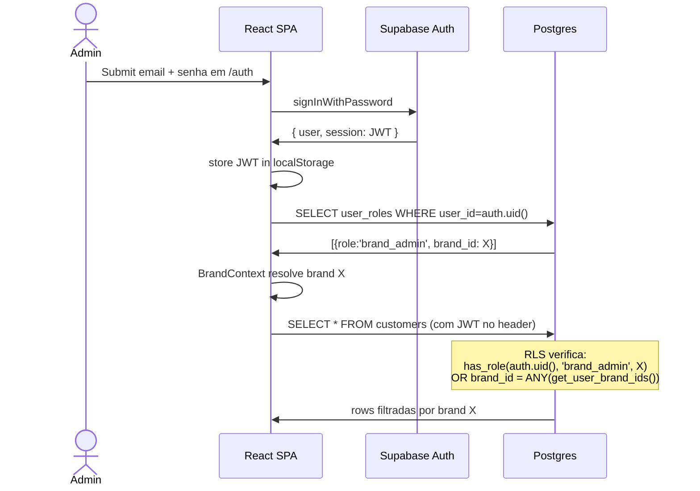
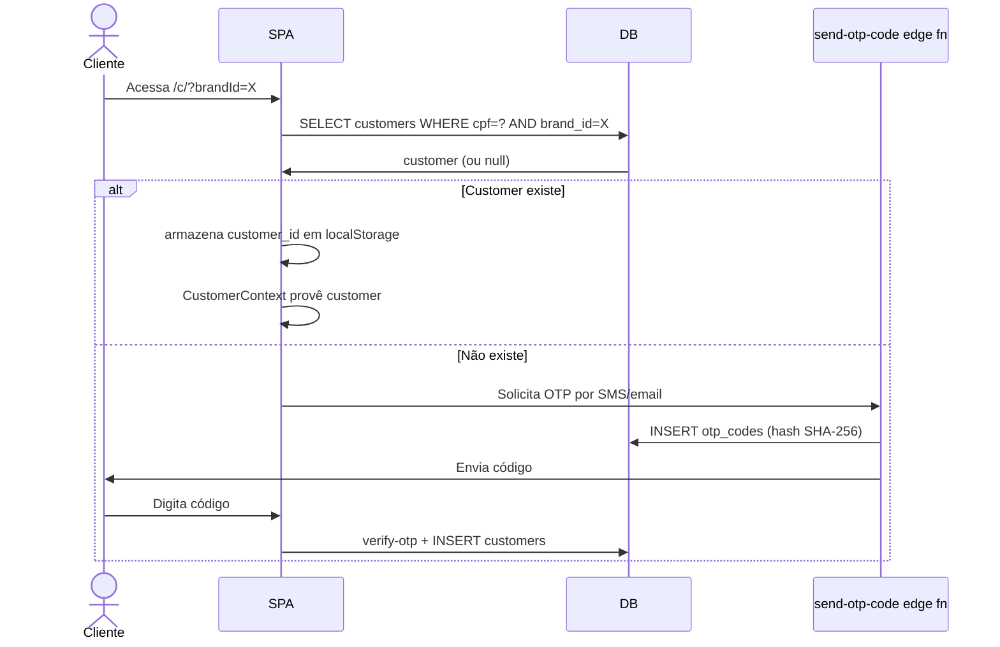
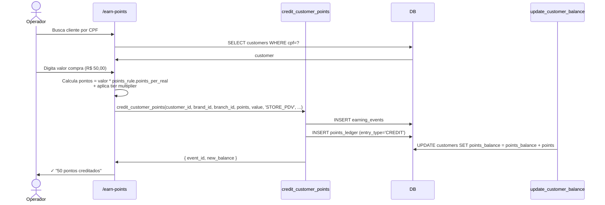
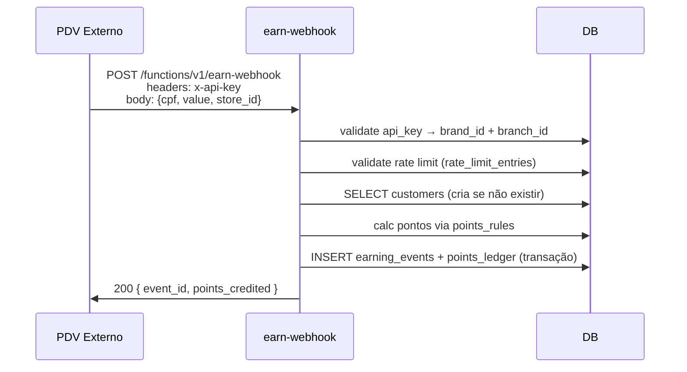
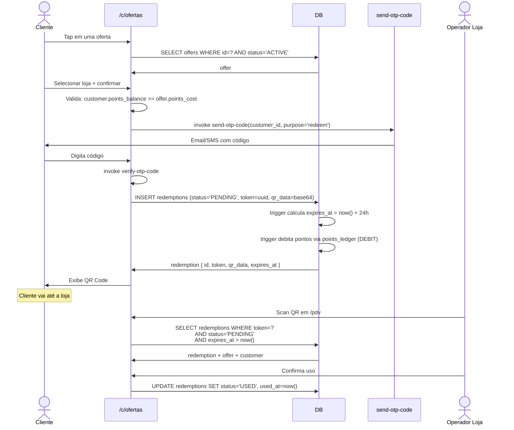

# Fase 2 — Engenharia Reversa da Arquitetura

Diagramas (ASCII + Mermaid) explicando como o sistema é montado, do
browser ao banco.

---

## 2.1 Visão geral (C4 — Sistema)



### ASCII equivalente

```
                  ┌──────────────────────────────────────┐
                  │  Fidelidade Vale Resgate (SaaS)      │
                  │                                      │
   ┌──────────┐   │  ┌──────────┐    ┌────────────────┐  │
   │  Admin   │──▶│  │  Admin   │    │  Edge Functions│  │
   │  Brand   │   │  │  Web App │    │  (Deno)        │  │
   └──────────┘   │  └────┬─────┘    │                │  │
                  │       │          │ earn-webhook   │  │
   ┌──────────┐   │  ┌────▼─────┐    │ send-otp       │  │
   │  Cliente │──▶│  │ Customer │◀──▶│ verify-otp     │  │
   │  Final   │   │  │ Storefront    │ send-push      │  │
   └──────────┘   │  └────┬─────┘    │ stripe-webhook │  │
                  │       │          └─────┬──────────┘  │
   ┌──────────┐   │  ┌────▼──────────┐     │             │
   │ Operador │──▶│  │ /pdv (valida QR)    │             │
   │  Loja    │   │  └──────┬────────┘     │             │
   └──────────┘   │         │              │             │
                  │      ┌──▼──────────────▼──┐          │
   ┌──────────┐   │      │  Supabase Postgres │          │
   │   PDV    │──▶│      │  + RLS + RPCs      │          │
   │ Externo  │   │      │  + Realtime        │          │
   └──────────┘   │      └────────────────────┘          │
                  └──────────────────────────────────────┘
                          │             │              │
                          ▼             ▼              ▼
                       Resend     Web Push       Stripe
                       (email)     Service        (billing)
```

---

## 2.2 Camadas (C4 — Container)



---

## 2.3 Multi-tenancy

```
                    ┌────────────────────────────────┐
                    │  Resolução de Brand            │
                    └───────────────┬────────────────┘
                                    │
                ┌───────────────────┼───────────────────┐
                │                   │                   │
        Hostname match         ?brandId param     User roles
        (brand_domains)        (URL query)        (auth user)
                │                   │                   │
                └──────────► get_boot_context ◄─────────┘
                                    │ (1 RPC)
                                    ▼
                    ┌──────────────────────────────┐
                    │  Brand resolvida + branches  │
                    │  + theme + roles             │
                    └──────────────┬───────────────┘
                                   │
                       Context React (BrandResolverContext)
                                   │
                                   ▼
                           ╔═══════════════╗
                           ║  RLS filtra   ║
                           ║  por brand_id ║
                           ║  em CADA      ║
                           ║  query        ║
                           ╚═══════════════╝
```

**Garantias de isolamento**:
- TODA tabela do escopo tem `brand_id` (FK NOT NULL)
- RLS policy padrão: `USING (brand_id = ANY(get_user_brand_ids(auth.uid())))`
- Trigger `validate_branch_integrity` bloqueia INSERT/UPDATE com `branch_id` de outra `brand_id`
- Edge functions com service_role validam `brand_id` no body antes de qualquer write

### Hierarquia

```
tenant (1 — o operador do SaaS)
   └── brand (N — clientes do SaaS / white-label)
         └── branch (N — cidades operadas pela brand)
               └── store (N — lojas dentro da cidade)
                     └── offer (N — ofertas da loja)

customer (vinculado a 1 brand + 1 branch corrente)
   └── points_ledger entries
   └── redemptions
   └── earning_events
```

---

## 2.4 Autenticação & Autorização



### Customer storefront (sem auth.users)



**Modelo de auth do customer**:
- NÃO usa `auth.users` (admin-only)
- CPF + `brand_id` é a tupla de identidade
- `customers.id` é UUID interno
- `localStorage` guarda customer_id para sessão persistente
- OTP server-side (PR #35) protege troca de identidade

---

## 2.5 Fluxo de pontuação (earning)



**Via webhook (PDV externo)**:


---

## 2.6 Fluxo de resgate (redemption)



---

## 2.7 Realtime (postgres_changes)

```
        ┌─────────────────────────────────┐
        │ Dashboard/Customer/Store Owner  │
        └──────────────┬──────────────────┘
                       │ subscribe
                       ▼
        ┌─────────────────────────────────────┐
        │  Supabase Realtime (WebSocket)      │
        │                                     │
        │  channel: 'dashboard-realtime-${X}' │
        │  filter:  'brand_id=eq.X'  ← PR #37 │
        │                                     │
        │  events: redemptions, machine_rides,│
        │           customers, offers (INSERT)│
        └─────────────────┬───────────────────┘
                          │
                          ▼
            queryClient.invalidateQueries(...)
                          │
                          ▼
                  Re-fetch & re-render
```

Sem o `filter: brand_id=eq.X` (corrigido na F4.1), o servidor mandava
events de TODAS as brands pra TODOS os subscribers, multiplicando custo
de bandwidth por N tenants.

---

## 2.8 Camadas de cache

```
              ┌──────────────────────────┐
              │   Browser (cliente)      │
              └────────────┬─────────────┘
                           │
              ┌────────────▼────────────────────┐
              │  React Query (TanStack)         │
              │  staleTime: 5min, gcTime: 10min │
              │  invalidate via Realtime        │
              └────────────┬────────────────────┘
                           │ miss
              ┌────────────▼────────────────────┐
              │  Service Worker (Workbox)       │
              │  cache assets + manifest        │
              └────────────┬────────────────────┘
                           │ miss
              ┌────────────▼────────────────────┐
              │  Lovable CDN                    │
              └────────────┬────────────────────┘
                           │ miss
              ┌────────────▼────────────────────┐
              │  Supabase REST API              │
              │  (Postgres + RLS + índices)     │
              └─────────────────────────────────┘
```

### Boot context (1 RPC em vez de 5-7 queries)

Antes do `get_boot_context`, o boot fazia em paralelo:
1. `user_roles` SELECT
2. `brand_domains` por subdomain
3. `brand_domains` por domain (fallback)
4. `brands` ou `public_brands_safe`
5. `profiles` (selected_branch_id)
6. `branches` lista

Em 5G/iOS Safari, essa rajada fazia HTTP/2 abortar conexões.
A RPC unificada consolida em 1 round-trip.

---

## 2.9 Webhooks (entrada e saída)

### Entrada (recebemos)

| Webhook | Auth | Endpoint | Trigger |
|---|---|---|---|
| **earn-webhook** | `x-api-key` header (validado contra `brand_api_keys`) | `/functions/v1/earn-webhook` | PDV externo registra compra |
| **stripe-webhook** | Signature header validado contra `STRIPE_WEBHOOK_SECRET` | `/functions/v1/stripe-webhook` | Stripe notifica de cobrança paga/falha |

### Saída (enviamos)

| Para | Trigger | Função |
|---|---|---|
| **Resend (email)** | `send-otp-code` | OTP de cliente fazendo signup/resgate |
| **Web Push** | `send-push-notification` | Notificação de oferta expirando, resgate pronto, etc |

---

## 2.10 Processamento assíncrono

```
        ┌────────────────────────────────────┐
        │  Edge Function (Deno)              │
        │  EdgeRuntime.waitUntil(promise)    │
        └─────────────┬──────────────────────┘
                      │
              ┌───────▼──────┐
              │ Response 200 │ ← cliente já desconectou
              └──────────────┘
                      │
        ┌─────────────▼──────────────────────┐
        │ Background work continua:          │
        │  - import-drivers-bulk: chunked    │
        │    de 500 rows (job em DB)         │
        │  - mirror-sync: scrape + categorize│
        │  - send-push: paralelo pra N subs  │
        └────────────────────────────────────┘
```

**Padrão atual** (sem fila):
- Workload longo: `EdgeRuntime.waitUntil()` no Deno
- Estado persistido em tabela de "jobs" (ex: `driver_import_jobs`)
- UI poll job_id periodicamente pra ver progresso
- Cleanup defensivo via `cleanup_stuck_*_jobs` cron (F5.4)

**Não tem**: SQS/RabbitMQ/queue real. Se workload crescer demais,
candidato a migrar pra fila gerenciada (Inngest, Trigger.dev, AWS SQS).

---

## 2.11 Diagrama de dependências (módulos)

```mermaid
graph LR
    A[App.tsx] --> B[AuthContext]
    A --> C[BrandResolverContext]
    A --> D[QueryClientProvider]
    C --> E[BrandDataContext]
    E --> F[BrandThemeContext]

    G[/admin/EarnPointsPage] --> C
    G --> H[earningService]
    H --> I[(supabase.rpc credit_customer_points)]
    I --> J[(points_ledger + earning_events)]
    J --> K[trigger: update_customer_balance]
    K --> L[(customers.points_balance)]

    M[/c/ofertas] --> N[CustomerContext]
    M --> O[CustomerRedeemFlow]
    O --> P[send-otp-code edge fn]
    P --> Q[Resend API]
    O --> R[verify-otp-code edge fn]
    O --> S[(redemptions INSERT)]
    S --> T[trigger: debita pontos]
```

---

## 2.12 Decisões arquiteturais críticas

| ADR | Decisão | Por quê | Trade-off |
|---|---|---|---|
| 1 | **Multi-tenant via RLS + `brand_id`** (não schema por tenant) | Simplicidade operacional. 1 DB pra todos. | RLS bug = vazamento cross-tenant. Mitigado por testes (`rlsCrossTenant.test.ts`) + trigger `validate_branch_integrity`. |
| 2 | **Customer auth = CPF + localStorage** (sem `auth.users`) | UX mobile: cliente não cria conta, só CPF. | localStorage perde-se em troca de device. OTP recupera. |
| 3 | **Ledger immutable + balance materializado** | Auditabilidade total + perf de read. | Bug em trigger = balance desincronizado. Reconciliação periódica via `reconcile_*` RPCs. |
| 4 | **Edge functions Deno** (não Lambda/Vercel fn) | Co-localização com Supabase, latência menor BR. | Limite 50MB bundle, sem long-running >60s. |
| 5 | **React Query pra todo state remoto** | Cache + invalidação + retry built-in. | Necessita disciplina com queryKeys. Factory em `queryKeys.ts`. |
| 6 | **Realtime via postgres_changes** (não Pusher/Ably) | Embutido no Supabase, JWT auth direto. | Acoplado ao Supabase (vendor lock-in). |
| 7 | **PWA com manifest dinâmico** | Cada brand = "app" diferente (logo/cor/nome). | Service worker complexo, cache hits diferentes por brand. |
| 8 | **Sem fila gerenciada** (background via `waitUntil`) | Menos infra pra rodar. | Workload longo (>60s) não suportado. |

---

> Próxima fase: [03-modelagem-banco.md](./03-modelagem-banco.md) — DDL completo.
