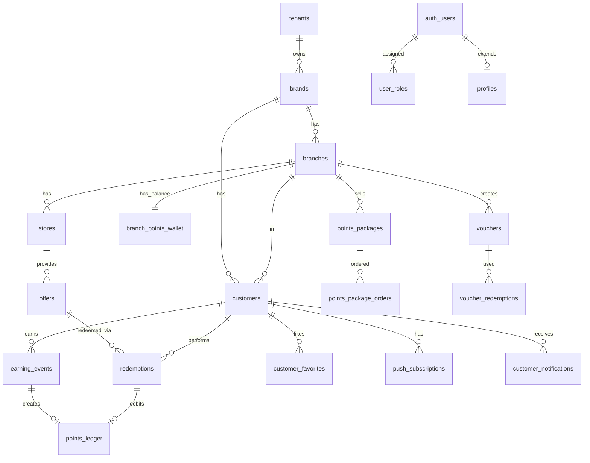

# Fase 3 — Modelagem do Banco (DDL completo)

DDL completo de todas as tabelas do escopo Loyalty + Redeem.
Extraído das migrations originais em `supabase/migrations/`.

> Convenção: TODA tabela tem `created_at` (e a maioria `updated_at`),
> trigger `update_updated_at_column()` mantém `updated_at`.
> RLS sempre habilitado (`ENABLE ROW LEVEL SECURITY`).
> `brand_id`/`branch_id` sempre NOT NULL com FK e ON DELETE CASCADE.

---

## 3.1 Enums utilizados

```sql
-- Status workflow de ofertas
CREATE TYPE public.offer_status AS ENUM (
  'DRAFT', 'PENDING', 'APPROVED', 'ACTIVE', 'EXPIRED'
);

-- Status do resgate (token QR)
CREATE TYPE public.redemption_status AS ENUM (
  'PENDING', 'USED', 'EXPIRED', 'CANCELED'
);

-- Tipo de regra de pontuação
CREATE TYPE public.points_rule_type AS ENUM (
  'PER_REAL', 'FIXED', 'TIERED'
);

-- Origem do ganho de pontos
CREATE TYPE public.earning_source AS ENUM (
  'STORE', 'PDV', 'ADMIN', 'IMPORT', 'API'
);

CREATE TYPE public.earning_status AS ENUM ('APPROVED', 'REJECTED');

-- Ledger
CREATE TYPE public.ledger_entry_type AS ENUM ('CREDIT', 'DEBIT');
CREATE TYPE public.ledger_reference_type AS ENUM (
  'EARNING_EVENT', 'REDEMPTION', 'MANUAL_ADJUSTMENT'
);

-- Voucher
CREATE TYPE public.voucher_status AS ENUM (
  'active', 'expired', 'depleted', 'cancelled'
);

-- App role
CREATE TYPE public.app_role AS ENUM (
  'root_admin', 'tenant_admin', 'brand_admin', 'branch_admin', 'store_owner'
);
```

---

## 3.2 Tabelas core

### `tenants`

**Finalidade**: Empresa operadora do SaaS. Em produção geralmente 1 só.

```sql
CREATE TABLE public.tenants (
  id UUID NOT NULL DEFAULT gen_random_uuid() PRIMARY KEY,
  name TEXT NOT NULL,
  slug TEXT NOT NULL UNIQUE,
  is_active BOOLEAN NOT NULL DEFAULT true,
  tenant_settings_json JSONB DEFAULT '{}',
  created_at TIMESTAMPTZ NOT NULL DEFAULT now()
);

ALTER TABLE public.tenants ENABLE ROW LEVEL SECURITY;

CREATE POLICY "Root manages tenants" ON public.tenants FOR ALL
  USING (has_role(auth.uid(), 'root_admin'::app_role));
```

### `brands`

**Finalidade**: Marca cliente do SaaS (white-label). Cada cliente = 1 brand.

```sql
CREATE TABLE public.brands (
  id UUID NOT NULL DEFAULT gen_random_uuid() PRIMARY KEY,
  tenant_id UUID NOT NULL REFERENCES public.tenants(id) ON DELETE CASCADE,
  name TEXT NOT NULL,
  slug TEXT NOT NULL,
  is_active BOOLEAN NOT NULL DEFAULT true,
  default_theme_id TEXT,
  brand_settings_json JSONB DEFAULT '{}',
  created_at TIMESTAMPTZ NOT NULL DEFAULT now(),
  UNIQUE(tenant_id, slug)
);

ALTER TABLE public.brands ENABLE ROW LEVEL SECURITY;

CREATE POLICY "Root manages brands" ON public.brands FOR ALL
  USING (has_role(auth.uid(), 'root_admin'::app_role));
CREATE POLICY "Tenant admins manage own brands" ON public.brands FOR ALL
  USING (tenant_id IN (SELECT get_user_tenant_ids(auth.uid())));
CREATE POLICY "Brand admins view own brand" ON public.brands FOR SELECT
  USING (id IN (SELECT get_user_brand_ids(auth.uid())));
```

**Campos do `brand_settings_json`** (estrutura típica):
```json
{
  "colors": { "primary": "#...", "secondary": "#...", "accent": "#..." },
  "logo_url": "https://...",
  "favicon_url": "https://...",
  "manifest": { "name": "...", "short_name": "..." },
  "modules": { "ganha_ganha": true, "vouchers": true, ... },
  "section_config": [ ... ]
}
```

### `branches`

**Finalidade**: Cidade/filial dentro de uma marca.

```sql
CREATE TABLE public.branches (
  id UUID NOT NULL DEFAULT gen_random_uuid() PRIMARY KEY,
  brand_id UUID NOT NULL REFERENCES public.brands(id) ON DELETE CASCADE,
  name TEXT NOT NULL,
  slug TEXT NOT NULL,
  city TEXT,
  state TEXT,
  timezone TEXT NOT NULL DEFAULT 'America/Sao_Paulo',
  latitude NUMERIC,
  longitude NUMERIC,
  is_active BOOLEAN NOT NULL DEFAULT true,
  branch_settings_json JSONB DEFAULT '{}',
  scoring_model TEXT DEFAULT 'DRIVER_ONLY',  -- 'PASSENGER_ONLY' | 'DRIVER_ONLY' | 'BOTH'
  created_at TIMESTAMPTZ NOT NULL DEFAULT now(),
  UNIQUE(brand_id, slug)
);

ALTER TABLE public.branches ENABLE ROW LEVEL SECURITY;
-- Policies análogas a brands (root + tenant + brand admin)
```

### `profiles`

**Finalidade**: Extensão de `auth.users` com dados de admin.

```sql
CREATE TABLE public.profiles (
  id UUID NOT NULL PRIMARY KEY REFERENCES auth.users(id) ON DELETE CASCADE,
  full_name TEXT,
  email TEXT,
  avatar_url TEXT,
  selected_branch_id UUID REFERENCES public.branches(id) ON DELETE SET NULL,
  created_at TIMESTAMPTZ NOT NULL DEFAULT now()
);

ALTER TABLE public.profiles ENABLE ROW LEVEL SECURITY;

CREATE POLICY "Users view own profile" ON public.profiles FOR SELECT
  USING (auth.uid() = id);
CREATE POLICY "Users update own profile" ON public.profiles FOR UPDATE
  USING (auth.uid() = id);
```

### `user_roles`

**Finalidade**: N:M entre `auth.users` e (`tenant`, `brand`, `branch`) com role.

```sql
CREATE TABLE public.user_roles (
  id UUID PRIMARY KEY DEFAULT gen_random_uuid(),
  user_id UUID NOT NULL REFERENCES auth.users(id) ON DELETE CASCADE,
  role app_role NOT NULL,
  tenant_id UUID REFERENCES public.tenants(id) ON DELETE CASCADE,
  brand_id UUID REFERENCES public.brands(id) ON DELETE CASCADE,
  branch_id UUID REFERENCES public.branches(id) ON DELETE CASCADE,
  created_at TIMESTAMPTZ NOT NULL DEFAULT now(),
  UNIQUE(user_id, role, tenant_id, brand_id, branch_id)
);

ALTER TABLE public.user_roles ENABLE ROW LEVEL SECURITY;
```

---

## 3.3 Cliente final (storefront)

### `customers`

**Finalidade**: Cliente final que ganha/resgata pontos.

```sql
CREATE TABLE public.customers (
  id UUID PRIMARY KEY DEFAULT gen_random_uuid(),
  user_id UUID REFERENCES auth.users(id),    -- nullable: cliente pode não ter auth.users
  brand_id UUID NOT NULL REFERENCES public.brands(id) ON DELETE CASCADE,
  branch_id UUID NOT NULL REFERENCES public.branches(id) ON DELETE CASCADE,
  name TEXT NOT NULL,
  phone TEXT,
  cpf TEXT,
  email TEXT,
  photo_url TEXT,
  points_balance NUMERIC NOT NULL DEFAULT 0,
  money_balance NUMERIC NOT NULL DEFAULT 0,
  customer_tier TEXT DEFAULT 'INICIANTE',
  external_driver_id TEXT,    -- vinculação opcional com sistema motorista
  crm_contact_id UUID,
  is_active BOOLEAN NOT NULL DEFAULT true,
  created_at TIMESTAMPTZ NOT NULL DEFAULT now(),
  updated_at TIMESTAMPTZ NOT NULL DEFAULT now()
);

CREATE INDEX idx_customers_brand_branch ON public.customers(brand_id, branch_id);
CREATE INDEX idx_customers_cpf ON public.customers(cpf) WHERE cpf IS NOT NULL;
CREATE UNIQUE INDEX idx_customers_brand_external_driver
  ON public.customers(brand_id, external_driver_id)
  WHERE external_driver_id IS NOT NULL;
CREATE INDEX idx_customers_customer_tier ON public.customers(brand_id, customer_tier);

ALTER TABLE public.customers ENABLE ROW LEVEL SECURITY;

CREATE POLICY "Select own customer" ON public.customers FOR SELECT
  USING (auth.uid() = user_id);
CREATE POLICY "Select customers (admin)" ON public.customers FOR SELECT USING (
  user_has_permission(auth.uid(), 'customers.read')
  AND (has_role(auth.uid(), 'root_admin') OR brand_id IN (SELECT get_user_brand_ids(auth.uid())))
);
CREATE POLICY "Insert customers" ON public.customers FOR INSERT WITH CHECK (
  user_has_permission(auth.uid(), 'customers.create') OR auth.uid() = user_id
);
CREATE POLICY "Update customers" ON public.customers FOR UPDATE USING (
  user_has_permission(auth.uid(), 'customers.update')
  OR auth.uid() = user_id
);

CREATE TRIGGER update_customers_updated_at BEFORE UPDATE ON public.customers
  FOR EACH ROW EXECUTE FUNCTION public.update_updated_at_column();
```

### `customer_favorites`

```sql
CREATE TABLE public.customer_favorites (
  id UUID PRIMARY KEY DEFAULT gen_random_uuid(),
  customer_id UUID NOT NULL REFERENCES public.customers(id) ON DELETE CASCADE,
  offer_id UUID NOT NULL REFERENCES public.offers(id) ON DELETE CASCADE,
  created_at TIMESTAMPTZ NOT NULL DEFAULT now(),
  UNIQUE(customer_id, offer_id)
);

CREATE INDEX idx_customer_favorites_customer ON public.customer_favorites(customer_id);
CREATE INDEX idx_customer_favorites_offer ON public.customer_favorites(offer_id);

ALTER TABLE public.customer_favorites ENABLE ROW LEVEL SECURITY;
-- Policies: customer manages own; admin reads
```

### `customer_favorite_stores`

```sql
CREATE TABLE public.customer_favorite_stores (
  id UUID PRIMARY KEY DEFAULT gen_random_uuid(),
  customer_id UUID NOT NULL REFERENCES public.customers(id) ON DELETE CASCADE,
  store_id UUID NOT NULL REFERENCES public.stores(id) ON DELETE CASCADE,
  created_at TIMESTAMPTZ NOT NULL DEFAULT now(),
  UNIQUE(customer_id, store_id)
);

ALTER TABLE public.customer_favorite_stores ENABLE ROW LEVEL SECURITY;
```

### `customer_notifications`

```sql
CREATE TABLE public.customer_notifications (
  id UUID PRIMARY KEY DEFAULT gen_random_uuid(),
  customer_id UUID NOT NULL REFERENCES public.customers(id) ON DELETE CASCADE,
  title TEXT NOT NULL,
  body TEXT,
  type TEXT NOT NULL,           -- 'OFFER_EXPIRING', 'REDEMPTION_READY', 'POINTS_CREDITED', etc
  reference_id UUID,
  reference_type TEXT,
  is_read BOOLEAN NOT NULL DEFAULT false,
  read_at TIMESTAMPTZ,
  created_at TIMESTAMPTZ NOT NULL DEFAULT now()
);

CREATE INDEX idx_customer_notifications_customer ON public.customer_notifications(customer_id, created_at DESC);
CREATE INDEX idx_customer_notifications_read ON public.customer_notifications(customer_id, is_read) WHERE is_read = false;

ALTER TABLE public.customer_notifications ENABLE ROW LEVEL SECURITY;
```

### `push_subscriptions`

```sql
CREATE TABLE public.push_subscriptions (
  id UUID PRIMARY KEY DEFAULT gen_random_uuid(),
  customer_id UUID NOT NULL REFERENCES public.customers(id) ON DELETE CASCADE,
  endpoint TEXT NOT NULL,
  keys_json JSONB NOT NULL,    -- { p256dh, auth }
  created_at TIMESTAMPTZ NOT NULL DEFAULT now(),
  UNIQUE(customer_id, endpoint)
);

CREATE INDEX idx_push_subscriptions_customer ON public.push_subscriptions(customer_id);

ALTER TABLE public.push_subscriptions ENABLE ROW LEVEL SECURITY;
```

---

## 3.4 Pontuação (5 tabelas)

### `points_rules`

**Finalidade**: Regra de pontuação por brand/branch.

```sql
CREATE TABLE public.points_rules (
  id UUID PRIMARY KEY DEFAULT gen_random_uuid(),
  brand_id UUID NOT NULL REFERENCES public.brands(id) ON DELETE CASCADE,
  branch_id UUID REFERENCES public.branches(id) ON DELETE CASCADE,
  rule_type points_rule_type NOT NULL DEFAULT 'PER_REAL',
  points_per_real NUMERIC NOT NULL DEFAULT 1.0,
  money_per_point NUMERIC NOT NULL DEFAULT 0.01,
  min_purchase_to_earn NUMERIC NOT NULL DEFAULT 10.0,
  max_points_per_purchase INTEGER NOT NULL DEFAULT 500,
  max_points_per_customer_per_day INTEGER NOT NULL DEFAULT 2000,
  max_points_per_store_per_day INTEGER NOT NULL DEFAULT 10000,
  require_receipt_code BOOLEAN NOT NULL DEFAULT false,
  is_active BOOLEAN NOT NULL DEFAULT true,
  created_at TIMESTAMPTZ NOT NULL DEFAULT now(),
  updated_at TIMESTAMPTZ NOT NULL DEFAULT now()
);

CREATE INDEX idx_points_rules_brand ON public.points_rules(brand_id, is_active);

ALTER TABLE public.points_rules ENABLE ROW LEVEL SECURITY;
-- Policies: root manages; brand/branch admins manage own; earners can SELECT active
```

### `tier_points_rules`

**Finalidade**: Multiplicador de pontos por tier do cliente.

```sql
CREATE TABLE public.tier_points_rules (
  id UUID PRIMARY KEY DEFAULT gen_random_uuid(),
  brand_id UUID NOT NULL REFERENCES public.brands(id) ON DELETE CASCADE,
  branch_id UUID REFERENCES public.branches(id) ON DELETE CASCADE,
  tier TEXT NOT NULL,    -- 'INICIANTE' | 'BRONZE' | 'PRATA' | 'OURO' | 'GALÁTICO'
  points_per_real NUMERIC NOT NULL,
  is_active BOOLEAN NOT NULL DEFAULT true,
  created_at TIMESTAMPTZ NOT NULL DEFAULT now(),
  UNIQUE(brand_id, branch_id, tier)
);

ALTER TABLE public.tier_points_rules ENABLE ROW LEVEL SECURITY;
```

### `store_points_rules`

**Finalidade**: Override de pontuação por loja específica (com aprovação).

```sql
CREATE TABLE public.store_points_rules (
  id UUID PRIMARY KEY DEFAULT gen_random_uuid(),
  brand_id UUID NOT NULL REFERENCES public.brands(id) ON DELETE CASCADE,
  branch_id UUID NOT NULL REFERENCES public.branches(id) ON DELETE CASCADE,
  store_id UUID NOT NULL REFERENCES public.stores(id) ON DELETE CASCADE,
  points_per_real NUMERIC NOT NULL,
  starts_at TIMESTAMPTZ,
  ends_at TIMESTAMPTZ,
  status TEXT NOT NULL DEFAULT 'PENDING_APPROVAL',  -- 'PENDING_APPROVAL' | 'ACTIVE' | 'REJECTED'
  created_by_user_id UUID NOT NULL,
  approved_by_user_id UUID,
  approved_at TIMESTAMPTZ,
  created_at TIMESTAMPTZ NOT NULL DEFAULT now()
);

CREATE INDEX idx_store_points_rules_store ON public.store_points_rules(store_id, status);
CREATE INDEX idx_store_points_rules_branch ON public.store_points_rules(branch_id, status);

ALTER TABLE public.store_points_rules ENABLE ROW LEVEL SECURITY;
```

### `earning_events`

**Finalidade**: Log de transações de ganho de pontos.

```sql
CREATE TABLE public.earning_events (
  id UUID PRIMARY KEY DEFAULT gen_random_uuid(),
  brand_id UUID NOT NULL REFERENCES public.brands(id) ON DELETE CASCADE,
  branch_id UUID NOT NULL REFERENCES public.branches(id) ON DELETE CASCADE,
  store_id UUID NOT NULL REFERENCES public.stores(id) ON DELETE CASCADE,
  customer_id UUID NOT NULL REFERENCES public.customers(id) ON DELETE CASCADE,
  purchase_value NUMERIC NOT NULL DEFAULT 0,
  receipt_code TEXT,
  points_earned INTEGER NOT NULL DEFAULT 0,
  money_earned NUMERIC NOT NULL DEFAULT 0,
  source earning_source NOT NULL DEFAULT 'STORE',
  status earning_status NOT NULL DEFAULT 'APPROVED',
  created_by_user_id UUID NOT NULL,
  created_at TIMESTAMPTZ NOT NULL DEFAULT now()
);

CREATE INDEX idx_earning_events_customer_day
  ON public.earning_events(customer_id, created_at DESC);
CREATE INDEX idx_earning_events_store_day
  ON public.earning_events(store_id, created_at DESC);
CREATE INDEX idx_earning_events_receipt
  ON public.earning_events(brand_id, receipt_code) WHERE receipt_code IS NOT NULL;

ALTER TABLE public.earning_events ENABLE ROW LEVEL SECURITY;

CREATE POLICY "Insert earning_events" ON public.earning_events FOR INSERT
  WITH CHECK (
    user_has_permission(auth.uid(), 'earn_points')
    AND (brand_id IN (SELECT get_user_brand_ids(auth.uid()))
         OR branch_id IN (SELECT get_user_branch_ids(auth.uid())))
  );
CREATE POLICY "Select own earning_events" ON public.earning_events FOR SELECT
  USING (customer_id IN (SELECT c.id FROM customers c WHERE c.user_id = auth.uid()));
```

### `points_ledger`

**Finalidade**: Ledger imutável append-only de pontos (CREDIT/DEBIT).

```sql
CREATE TABLE public.points_ledger (
  id UUID PRIMARY KEY DEFAULT gen_random_uuid(),
  brand_id UUID NOT NULL REFERENCES public.brands(id) ON DELETE CASCADE,
  branch_id UUID NOT NULL REFERENCES public.branches(id) ON DELETE CASCADE,
  customer_id UUID NOT NULL REFERENCES public.customers(id) ON DELETE CASCADE,
  entry_type ledger_entry_type NOT NULL,
  points_amount INTEGER NOT NULL DEFAULT 0,
  money_amount NUMERIC NOT NULL DEFAULT 0,
  reason TEXT,
  reference_type ledger_reference_type NOT NULL,
  reference_id UUID,
  created_by_user_id UUID NOT NULL,
  created_at TIMESTAMPTZ NOT NULL DEFAULT now()
);

CREATE INDEX idx_points_ledger_customer
  ON public.points_ledger(customer_id, created_at DESC);
CREATE INDEX idx_points_ledger_reference
  ON public.points_ledger(reference_type, reference_id);

ALTER TABLE public.points_ledger ENABLE ROW LEVEL SECURITY;
-- Sem UPDATE policy: ledger é imutável após INSERT
```

---

## 3.5 Lojas, Ofertas, Resgates

### `stores`

```sql
CREATE TABLE public.stores (
  id UUID PRIMARY KEY DEFAULT gen_random_uuid(),
  brand_id UUID NOT NULL REFERENCES public.brands(id),
  branch_id UUID NOT NULL REFERENCES public.branches(id),
  name TEXT NOT NULL,
  slug TEXT NOT NULL,
  logo_url TEXT,
  category TEXT,
  address TEXT,
  whatsapp TEXT,
  is_active BOOLEAN NOT NULL DEFAULT true,
  created_at TIMESTAMPTZ NOT NULL DEFAULT now(),
  updated_at TIMESTAMPTZ NOT NULL DEFAULT now(),
  UNIQUE(branch_id, slug)
);

ALTER TABLE public.stores ENABLE ROW LEVEL SECURITY;

CREATE POLICY "Anon read active stores" ON public.stores FOR SELECT
  USING (is_active = true);
-- Policies CRUD admin omitidas por brevidade (padrão user_has_permission)

CREATE TRIGGER update_stores_updated_at BEFORE UPDATE ON public.stores
  FOR EACH ROW EXECUTE FUNCTION public.update_updated_at_column();
```

### `offers`

```sql
CREATE TABLE public.offers (
  id UUID PRIMARY KEY DEFAULT gen_random_uuid(),
  brand_id UUID NOT NULL REFERENCES public.brands(id),
  branch_id UUID NOT NULL REFERENCES public.branches(id),
  store_id UUID NOT NULL REFERENCES public.stores(id),
  title TEXT NOT NULL,
  image_url TEXT,
  description TEXT,
  value_rescue NUMERIC NOT NULL DEFAULT 0,
  min_purchase NUMERIC NOT NULL DEFAULT 0,
  start_at TIMESTAMPTZ,
  end_at TIMESTAMPTZ,
  allowed_weekdays INTEGER[] DEFAULT '{0,1,2,3,4,5,6}',  -- 0=domingo
  allowed_hours TEXT,                                     -- '09:00-18:00'
  max_daily_redemptions INTEGER,
  status offer_status NOT NULL DEFAULT 'DRAFT',
  is_active BOOLEAN NOT NULL DEFAULT true,
  likes_count INTEGER NOT NULL DEFAULT 0,
  created_at TIMESTAMPTZ NOT NULL DEFAULT now(),
  updated_at TIMESTAMPTZ NOT NULL DEFAULT now()
);

CREATE INDEX idx_offers_brand_status ON public.offers(brand_id, status)
  WHERE is_active = true;
CREATE INDEX idx_offers_store ON public.offers(store_id, status);

-- Trigger: oferta deve apontar pra store com brand+branch matching
CREATE OR REPLACE FUNCTION public.validate_offer_branch()
RETURNS trigger LANGUAGE plpgsql SECURITY DEFINER SET search_path = public AS $$
BEGIN
  IF NOT EXISTS (
    SELECT 1 FROM stores
    WHERE id = NEW.store_id
      AND branch_id = NEW.branch_id
      AND brand_id = NEW.brand_id
  ) THEN
    RAISE EXCEPTION 'Offer brand_id/branch_id must match the store';
  END IF;
  RETURN NEW;
END;
$$;
CREATE TRIGGER trg_validate_offer_branch BEFORE INSERT OR UPDATE ON public.offers
  FOR EACH ROW EXECUTE FUNCTION public.validate_offer_branch();

ALTER TABLE public.offers ENABLE ROW LEVEL SECURITY;

CREATE POLICY "Anon read active offers" ON public.offers FOR SELECT
  USING (is_active = true AND status = 'ACTIVE');
```

### `redemptions`

```sql
CREATE TABLE public.redemptions (
  id UUID PRIMARY KEY DEFAULT gen_random_uuid(),
  brand_id UUID NOT NULL REFERENCES public.brands(id),
  branch_id UUID NOT NULL REFERENCES public.branches(id),
  customer_id UUID NOT NULL REFERENCES public.customers(id),
  offer_id UUID NOT NULL REFERENCES public.offers(id),
  token TEXT NOT NULL DEFAULT encode(gen_random_bytes(16), 'hex'),
  qr_data TEXT,
  status redemption_status NOT NULL DEFAULT 'PENDING',
  purchase_value NUMERIC,
  store_id UUID REFERENCES public.stores(id),
  expires_at TIMESTAMPTZ,
  used_at TIMESTAMPTZ,
  created_at TIMESTAMPTZ NOT NULL DEFAULT now()
);

CREATE INDEX idx_redemptions_customer
  ON public.redemptions(customer_id, created_at DESC);
CREATE INDEX idx_redemptions_token
  ON public.redemptions(token) WHERE status = 'PENDING';
CREATE INDEX idx_redemptions_brand_status_created
  ON public.redemptions(brand_id, status, created_at DESC);

-- Trigger: redemption.branch/brand deve bater com offer e customer
CREATE OR REPLACE FUNCTION public.validate_redemption_branch()
RETURNS trigger LANGUAGE plpgsql SECURITY DEFINER SET search_path = public AS $$
BEGIN
  IF NOT EXISTS (SELECT 1 FROM offers WHERE id = NEW.offer_id
                   AND branch_id = NEW.branch_id AND brand_id = NEW.brand_id) THEN
    RAISE EXCEPTION 'Redemption branch/brand must match the offer';
  END IF;
  IF NOT EXISTS (SELECT 1 FROM customers WHERE id = NEW.customer_id
                   AND branch_id = NEW.branch_id AND brand_id = NEW.brand_id) THEN
    RAISE EXCEPTION 'Redemption branch/brand must match the customer';
  END IF;
  RETURN NEW;
END;
$$;
CREATE TRIGGER trg_validate_redemption_branch
  BEFORE INSERT OR UPDATE ON public.redemptions
  FOR EACH ROW EXECUTE FUNCTION public.validate_redemption_branch();

ALTER TABLE public.redemptions ENABLE ROW LEVEL SECURITY;

CREATE POLICY "Select own redemptions" ON public.redemptions FOR SELECT
  USING (customer_id IN (SELECT id FROM customers WHERE user_id = auth.uid()));
```

### `product_redemption_orders`

```sql
CREATE TABLE public.product_redemption_orders (
  id UUID PRIMARY KEY DEFAULT gen_random_uuid(),
  brand_id UUID NOT NULL REFERENCES public.brands(id),
  branch_id UUID NOT NULL REFERENCES public.branches(id),
  customer_id UUID NOT NULL REFERENCES public.customers(id),
  deal_id UUID NOT NULL,  -- referência a affiliate_deals
  points_spent INTEGER NOT NULL,
  status TEXT NOT NULL DEFAULT 'PENDING',  -- PENDING | APPROVED | REJECTED | SHIPPED | DELIVERED
  customer_name TEXT NOT NULL,
  customer_phone TEXT NOT NULL,
  customer_cpf TEXT,
  delivery_cep TEXT,
  delivery_address TEXT,
  delivery_number TEXT,
  delivery_complement TEXT,
  delivery_city TEXT,
  delivery_state TEXT,
  tracking_code TEXT,
  reviewed_by UUID,
  reviewed_at TIMESTAMPTZ,
  notes TEXT,
  product_snapshot_json JSONB,
  created_at TIMESTAMPTZ NOT NULL DEFAULT now(),
  updated_at TIMESTAMPTZ NOT NULL DEFAULT now()
);

ALTER TABLE public.product_redemption_orders ENABLE ROW LEVEL SECURITY;
```

---

## 3.6 Vouchers

### `vouchers`

```sql
CREATE TABLE public.vouchers (
  id UUID PRIMARY KEY DEFAULT gen_random_uuid(),
  branch_id UUID NOT NULL REFERENCES public.branches(id) ON DELETE CASCADE,
  code TEXT NOT NULL,
  title TEXT NOT NULL,
  description TEXT,
  discount_percent NUMERIC,           -- mutuamente exclusivo com discount_value
  discount_value NUMERIC,
  status voucher_status NOT NULL DEFAULT 'active',
  max_uses INTEGER,
  current_uses INTEGER NOT NULL DEFAULT 0,
  expires_at TIMESTAMPTZ,
  campaign TEXT,
  created_by UUID,
  created_at TIMESTAMPTZ NOT NULL DEFAULT now(),
  updated_at TIMESTAMPTZ NOT NULL DEFAULT now(),
  UNIQUE(code, branch_id)
);

ALTER TABLE public.vouchers ENABLE ROW LEVEL SECURITY;
-- Policies CRUD admin (root_admin, brand_admin, branch_admin)
```

### `voucher_redemptions`

```sql
CREATE TABLE public.voucher_redemptions (
  id UUID PRIMARY KEY DEFAULT gen_random_uuid(),
  voucher_id UUID NOT NULL REFERENCES public.vouchers(id) ON DELETE CASCADE,
  redeemed_by UUID,    -- auth.user_id ou customer_id
  notes TEXT,
  redeemed_at TIMESTAMPTZ NOT NULL DEFAULT now()
);

ALTER TABLE public.voucher_redemptions ENABLE ROW LEVEL SECURITY;
```

---

## 3.7 Wallet de branch + Pacotes de pontos

### `branch_points_wallet`

```sql
CREATE TABLE public.branch_points_wallet (
  id UUID PRIMARY KEY DEFAULT gen_random_uuid(),
  branch_id UUID NOT NULL REFERENCES public.branches(id) ON DELETE CASCADE UNIQUE,
  brand_id UUID NOT NULL REFERENCES public.brands(id) ON DELETE CASCADE,
  balance NUMERIC NOT NULL DEFAULT 0,
  total_loaded NUMERIC NOT NULL DEFAULT 0,
  total_distributed NUMERIC NOT NULL DEFAULT 0,
  updated_at TIMESTAMPTZ NOT NULL DEFAULT now()
);

ALTER TABLE public.branch_points_wallet ENABLE ROW LEVEL SECURITY;
```

### `branch_wallet_transactions`

```sql
CREATE TABLE public.branch_wallet_transactions (
  id UUID PRIMARY KEY DEFAULT gen_random_uuid(),
  branch_id UUID NOT NULL REFERENCES public.branches(id) ON DELETE CASCADE,
  brand_id UUID NOT NULL REFERENCES public.brands(id) ON DELETE CASCADE,
  transaction_type TEXT NOT NULL,   -- 'LOAD' | 'DEBIT' | 'TRANSFER'
  amount NUMERIC NOT NULL,
  balance_after NUMERIC NOT NULL,
  description TEXT,
  reference_type TEXT,
  reference_id UUID,
  created_by UUID NOT NULL,
  created_at TIMESTAMPTZ NOT NULL DEFAULT now()
);

CREATE INDEX idx_bwt_branch_created
  ON public.branch_wallet_transactions(branch_id, created_at DESC);

ALTER TABLE public.branch_wallet_transactions ENABLE ROW LEVEL SECURITY;
```

### `points_packages`

```sql
CREATE TABLE public.points_packages (
  id UUID PRIMARY KEY DEFAULT gen_random_uuid(),
  brand_id UUID NOT NULL REFERENCES public.brands(id) ON DELETE CASCADE,
  name TEXT NOT NULL,
  description TEXT,
  points_amount INTEGER NOT NULL,
  price_cents INTEGER NOT NULL,
  is_active BOOLEAN NOT NULL DEFAULT true,
  sort_order INTEGER DEFAULT 0,
  created_at TIMESTAMPTZ NOT NULL DEFAULT now(),
  updated_at TIMESTAMPTZ NOT NULL DEFAULT now()
);

ALTER TABLE public.points_packages ENABLE ROW LEVEL SECURITY;
```

### `points_package_orders`

```sql
CREATE TABLE public.points_package_orders (
  id UUID PRIMARY KEY DEFAULT gen_random_uuid(),
  package_id UUID NOT NULL REFERENCES public.points_packages(id) ON DELETE RESTRICT,
  branch_id UUID NOT NULL REFERENCES public.branches(id) ON DELETE CASCADE,
  brand_id UUID NOT NULL REFERENCES public.brands(id) ON DELETE CASCADE,
  points_amount INTEGER NOT NULL,
  price_cents INTEGER NOT NULL,
  status TEXT NOT NULL DEFAULT 'PENDING',  -- 'PENDING' | 'CONFIRMED' | 'CANCELED'
  purchased_by UUID NOT NULL,
  confirmed_by UUID,
  confirmed_at TIMESTAMPTZ,
  payment_reference TEXT,
  created_at TIMESTAMPTZ NOT NULL DEFAULT now()
);

ALTER TABLE public.points_package_orders ENABLE ROW LEVEL SECURITY;
```

---

## 3.8 OTP (server-side, F2)

### `otp_codes`

```sql
CREATE TABLE public.otp_codes (
  id UUID PRIMARY KEY DEFAULT gen_random_uuid(),
  identifier TEXT NOT NULL,         -- email/phone/cpf normalizado
  identifier_type TEXT NOT NULL,
  purpose TEXT NOT NULL,            -- 'redeem' | 'driver_verify' | 'signup'
  code_hash TEXT NOT NULL,          -- SHA-256 hex
  brand_id UUID REFERENCES public.brands(id),
  used BOOLEAN NOT NULL DEFAULT false,
  used_at TIMESTAMPTZ,
  expires_at TIMESTAMPTZ NOT NULL,  -- now() + 10 min
  verify_attempts INTEGER NOT NULL DEFAULT 0,
  created_at TIMESTAMPTZ NOT NULL DEFAULT now()
);

CREATE INDEX idx_otp_codes_lookup
  ON public.otp_codes(identifier, purpose, used, expires_at);

ALTER TABLE public.otp_codes ENABLE ROW LEVEL SECURITY;
-- RLS bloqueia tudo pra anon/authenticated; só service_role pode ler/escrever
```

---

## 3.9 Tabelas auxiliares

### `taxonomy_categories`, `taxonomy_segments`

```sql
CREATE TABLE public.taxonomy_categories (
  id UUID PRIMARY KEY DEFAULT gen_random_uuid(),
  name TEXT NOT NULL,
  slug TEXT NOT NULL UNIQUE,
  icon_name TEXT,
  is_active BOOLEAN NOT NULL DEFAULT true,
  order_index INTEGER NOT NULL DEFAULT 0,
  created_at TIMESTAMPTZ NOT NULL DEFAULT now(),
  updated_at TIMESTAMPTZ NOT NULL DEFAULT now()
);

CREATE TABLE public.taxonomy_segments (
  id UUID PRIMARY KEY DEFAULT gen_random_uuid(),
  category_id UUID NOT NULL REFERENCES public.taxonomy_categories(id) ON DELETE CASCADE,
  name TEXT NOT NULL,
  slug TEXT NOT NULL,
  description TEXT,
  aliases TEXT[],
  keywords TEXT[],
  related_segment_ids UUID[],
  is_active BOOLEAN NOT NULL DEFAULT true,
  order_index INTEGER NOT NULL DEFAULT 0,
  created_at TIMESTAMPTZ NOT NULL DEFAULT now()
);

CREATE INDEX idx_taxonomy_segments_aliases ON public.taxonomy_segments USING GIN (aliases);
CREATE INDEX idx_taxonomy_segments_keywords ON public.taxonomy_segments USING GIN (keywords);
CREATE INDEX idx_taxonomy_segments_name_trgm ON public.taxonomy_segments USING GIN (name gin_trgm_ops);
```

### `audit_logs`

```sql
CREATE TABLE public.audit_logs (
  id UUID PRIMARY KEY DEFAULT gen_random_uuid(),
  brand_id UUID,
  branch_id UUID,
  user_id UUID,
  action TEXT NOT NULL,                -- 'create' | 'update' | 'delete' | ...
  entity_type TEXT NOT NULL,           -- 'customer' | 'offer' | etc
  entity_id UUID,
  diff_json JSONB,
  ip_address TEXT,
  user_agent TEXT,
  created_at TIMESTAMPTZ NOT NULL DEFAULT now()
);

CREATE INDEX idx_audit_logs_brand_created ON public.audit_logs(brand_id, created_at DESC);
```

---

## 3.10 Funções helper de RLS

```sql
-- Verifica role em determinado escopo (tenant_id/brand_id/branch_id opcional)
CREATE OR REPLACE FUNCTION public.has_role(
  _user_id UUID,
  _role app_role,
  _scope_id UUID DEFAULT NULL
)
RETURNS BOOLEAN LANGUAGE sql STABLE SECURITY DEFINER SET search_path = public AS $$
  SELECT EXISTS (
    SELECT 1 FROM user_roles
    WHERE user_id = _user_id AND role = _role
      AND (_scope_id IS NULL
           OR tenant_id = _scope_id
           OR brand_id = _scope_id
           OR branch_id = _scope_id)
  );
$$;

-- Lista de brand_ids que o user pode acessar (role-aware)
CREATE OR REPLACE FUNCTION public.get_user_brand_ids(_user_id UUID)
RETURNS SETOF UUID LANGUAGE sql STABLE SECURITY DEFINER SET search_path = public AS $$
  SELECT DISTINCT brand_id FROM user_roles
  WHERE user_id = _user_id AND brand_id IS NOT NULL;
$$;

CREATE OR REPLACE FUNCTION public.get_user_branch_ids(_user_id UUID)
RETURNS SETOF UUID LANGUAGE sql STABLE SECURITY DEFINER SET search_path = public AS $$
  SELECT DISTINCT branch_id FROM user_roles
  WHERE user_id = _user_id AND branch_id IS NOT NULL;
$$;

CREATE OR REPLACE FUNCTION public.user_has_permission(_user_id UUID, _permission TEXT)
RETURNS BOOLEAN LANGUAGE sql STABLE SECURITY DEFINER SET search_path = public AS $$
  SELECT EXISTS (
    SELECT 1 FROM user_roles ur
    JOIN role_permissions rp ON rp.role = ur.role
    JOIN permissions p ON p.id = rp.permission_id
    WHERE ur.user_id = _user_id AND p.key = _permission
  );
$$;
```

---

## 3.11 Triggers críticos

```sql
-- Mantém updated_at coerente
CREATE OR REPLACE FUNCTION public.update_updated_at_column()
RETURNS trigger LANGUAGE plpgsql AS $$
BEGIN
  NEW.updated_at = now();
  RETURN NEW;
END;
$$;

-- Atualiza customers.points_balance ao inserir no ledger
CREATE OR REPLACE FUNCTION public.update_customer_balance_from_ledger()
RETURNS trigger LANGUAGE plpgsql SECURITY DEFINER SET search_path = public AS $$
BEGIN
  IF NEW.entry_type = 'CREDIT' THEN
    UPDATE customers SET
      points_balance = points_balance + NEW.points_amount,
      money_balance = money_balance + NEW.money_amount,
      updated_at = now()
    WHERE id = NEW.customer_id;
  ELSE
    UPDATE customers SET
      points_balance = points_balance - NEW.points_amount,
      money_balance = money_balance - NEW.money_amount,
      updated_at = now()
    WHERE id = NEW.customer_id;
  END IF;
  RETURN NEW;
END;
$$;
CREATE TRIGGER trg_update_customer_balance
  AFTER INSERT ON public.points_ledger
  FOR EACH ROW EXECUTE FUNCTION public.update_customer_balance_from_ledger();

-- Calcula expires_at automaticamente em redemptions
CREATE OR REPLACE FUNCTION public.set_redemption_expires_at()
RETURNS trigger LANGUAGE plpgsql AS $$
BEGIN
  IF NEW.expires_at IS NULL THEN
    NEW.expires_at = COALESCE(NEW.created_at, now()) + INTERVAL '24 hours';
  END IF;
  RETURN NEW;
END;
$$;
CREATE TRIGGER trg_set_redemption_expires_at
  BEFORE INSERT ON public.redemptions
  FOR EACH ROW EXECUTE FUNCTION public.set_redemption_expires_at();
```

---

## 3.12 Diagrama ER (resumo)



---

> Próxima fase: [04-regras-de-negocio.md](./04-regras-de-negocio.md)
